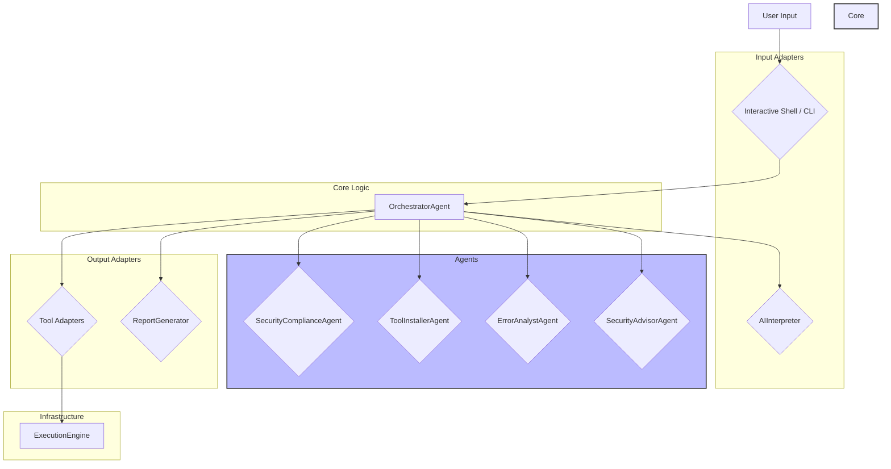

# System Patterns

## 1. High-Level Architecture

The framework is designed using a **Multi-Agent System architecture**, which is a variation of a modular, service-oriented design. The core principle is the separation of concerns, where different "agents" are responsible for specific tasks, all coordinated by a central orchestrator.

## 2. Key Design Patterns & Technical Rationale

- **Agent-Based Architecture:** The project was explicitly refactored into a multi-agent system based on the stakeholder's vision. This pattern promotes high cohesion and low coupling. Each agent has a single, well-defined responsibility (e.g., logging, installation, error analysis). This makes the system easier to maintain, test, and extend, as new capabilities can be added by creating new agents without modifying the core orchestration logic significantly.

- **Dependency Injection / Composition Root:** All components and agents are instantiated and "wired together" in a single place: the `build_agent_system` function in `src/termux_cyber_framework/adapters/cli/main.py`. This acts as the Composition Root of the application, making dependencies explicit and centralizing the application's construction logic.

- **Ports and Adapters (Hexagonal Architecture):** The initial design of the application followed a Ports and Adapters pattern. The agent-based refactoring builds on this by treating agents as implementations of specific ports or roles. For example, the `LoggerAgent` implements the `LoggerPort`. This keeps the core logic (the orchestrator) decoupled from the concrete implementation of the services it uses.

- **Strategy Pattern:** The `ToolInstallerAgent` uses the Strategy Pattern to handle different installation methods. It holds a dictionary of `InstallerStrategyPort` implementations (`PkgInstallerAdapter`, `GitInstallerAdapter`, `PipInstallerAdapter`) and chooses the correct one at runtime based on the tool's configuration.

- **Facade Pattern:** The `ToolInstallerAgent` and `LoggerAgent` act as Facades, providing a simple, unified interface to a more complex underlying subsystem (e.g., the different installer strategies or the file-based logging adapter).
